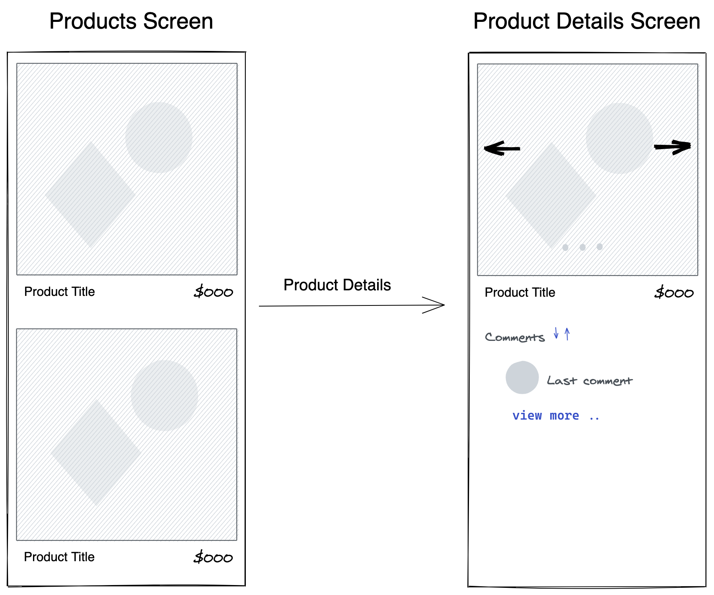

## Challenge Idea
The purpose of this task is to show your ReactNative skills (javascript, styling, networkig), one screen should be implemented that shows products list and the user can click on any product to get its details screen

## Acceptance Criteria
- The application starts with listing all products screen
   http://my-json-server.typicode.com/WhatsLab/code-challenge/products
- The user can click on any product to get details screen,
   http://my-json-server.typicode.com/WhatsLab/code-challenge/productDetails/{id}
- The user should find an image gallery slider at product details screen
- The user should see the latest comment and with view more link and  can expand to see more
- The user can sort comments based on comment score

## Expectations

- Function Component and React Hooks must be used
- Unit testing
- No plugin should be used for pagination and image gallery
- How will the components communicate with each other ?
- Quality over quantity
- For uncompleted points please mention in the readme how you were going to implement them.

We are looking for **readability, documentation, good architectural decisions, eye for performance, modularity, and unit tested code.**
