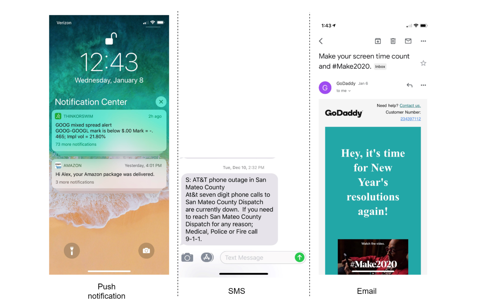

# Back end developer Assignment

- You are design a notification system, complete with tests, local deployment environment and documentation

- while we have a strong preference for solutions provided in Python, we are accepting solutions in other languages suited for development of backend services like Node.JS, Go or Java

- A notification is more than just mobile push notification. Three types of notification formats are: mobile push notification, SMS message, and Email.

- We want a user to receive notifications as soon as possible. However, if the system is under a high workload, a slight delay is acceptable. 

- Notifications can be triggered by client applications. They can also be scheduled on the server-side.

- We expected daily notifications equal 10 million mobile push notifications, 1 million SMS messages, and 5 million emails.

